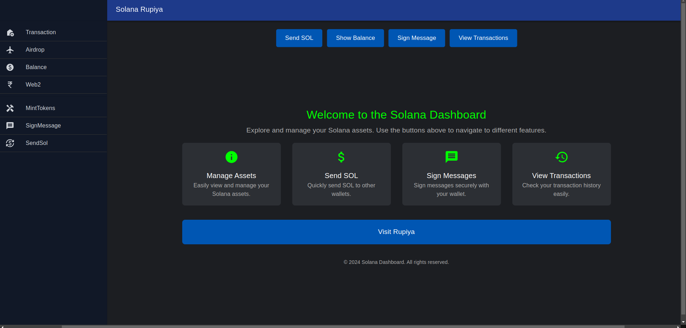
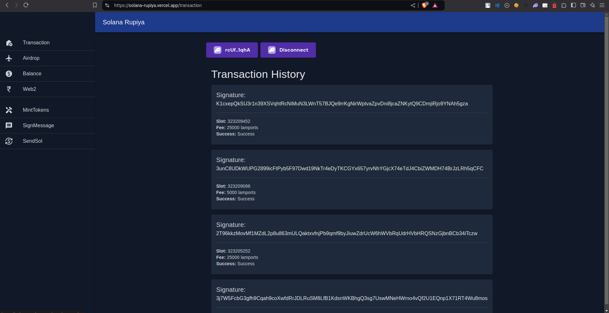
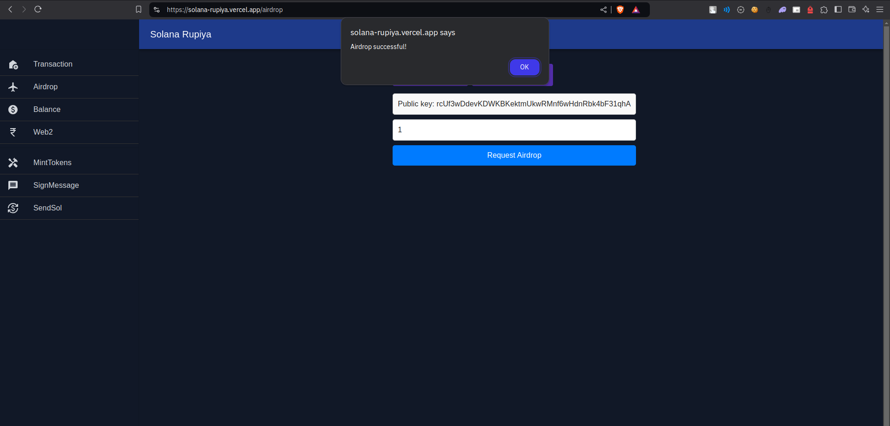
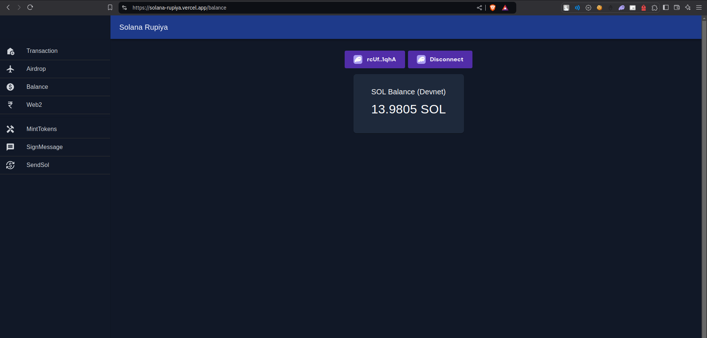
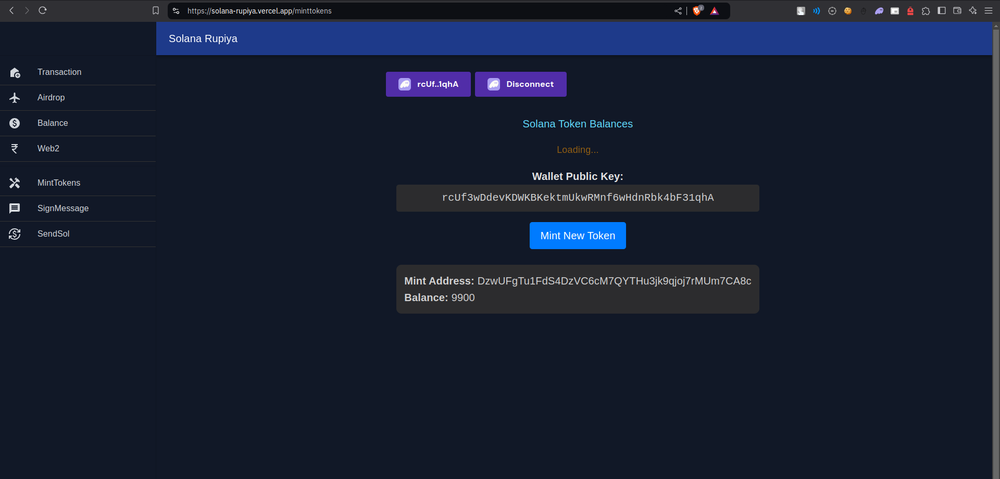
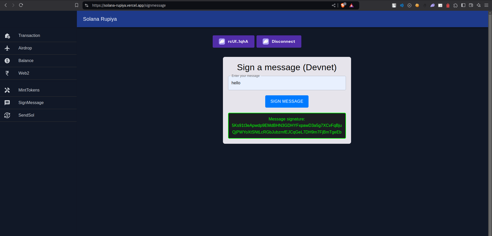
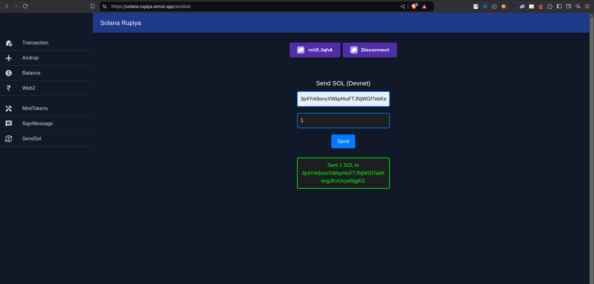

# Solana Rupiya

A comprehensive dashboard for exploring and managing your Solana assets on the Devnet.

## The main repo is private 

## Overview

Solana Rupiya is a web application built on React and the Solana blockchain that provides users with a simple, intuitive interface to interact with their Solana assets. The application connects to the Solana Devnet, allowing users to manage tokens, view balances, send SOL, check transaction history, and more.

## Features

### Asset Management
- **Balance Check**: View your SOL balance in real-time with automatic refresh
- **Token Balances**: Examine all tokens in your wallet with detailed information
- **Token Minting**: Create new tokens with just a few clicks

### Transactions
- **Send SOL**: Transfer SOL to other addresses
- **Transaction History**: View your complete transaction history
- **Airdrop**: Request SOL airdrop on the Devnet for testing

### Security & Utilities
- **Sign Messages**: Cryptographically sign messages with your Solana wallet
- **Wallet Integration**: Seamless connection with Solana wallets like Phantom

### Integration
- **Rupiya Payment Integration**: Connect to the Rupiya payment platform for bank transfers and UPI payments

## Screenshots

## Homepage

## Transaction

## Airdrop

## Balance

## Mint Tokens

## Sign Message

## Send Sol

## Technologies Used

- **Frontend**: React, Material-UI
- **Blockchain**: Solana Web3.js, SPL Token
- **Wallet Adapters**: Solana Wallet Adapter
- **Build Tools**: Vite

## Requirements

- Node.js (v14 or higher)
- npm or yarn
- A Solana wallet (like Phantom)

## Important Notes

- This application currently connects to the **Solana Devnet**, not the mainnet
- Use caution when testing with real wallets
- SOL acquired via airdrop on Devnet has no real-world value

## External Integrations

The application integrates with the Rupiya payment platform at [https://rupiya-six.vercel.app/](https://rupiya-six.vercel.app/) for traditional banking operations.

## License

This project is licensed under the MIT License - see the LICENSE file for details.

## Contact

For questions, issues, or contributions, please open an issue on the [GitHub repository](https://github.com/NiladriHazra/Solana-Rupiya).

---

Created by [Niladri Hazra](https://github.com/NiladriHazra)